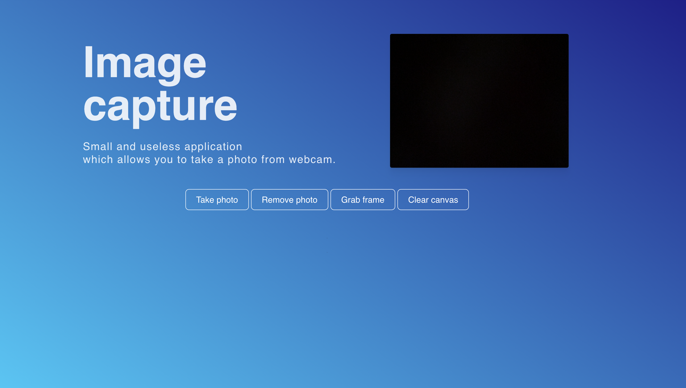

# Image capture application

## Functionality

- during initialisation application request access rights for media stream capture from user webcam;
- captured stream placed into the `video` element;
- video track extracted from the stream and passed to the interface for image capturing;
- user have abilities to take a photo and grab the frames;
- photo placed into the `img` element and generated download link;

